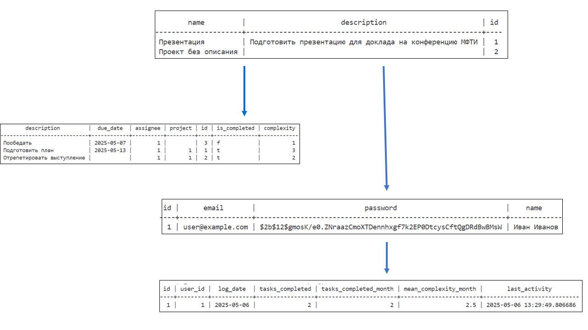

# Система управления задачами на FastAPI

Этот проект представляет собой приложение для управления задачами, разработанное с использованием FastAPI. Оно предоставляет API для создания, обновления, удаления и получения задач.

## Функциональность

- Создание пользователей
- Создание проектов с их описанием
- Создание задач по каждому проекту или без привязки к проекту
- Учёт сложности задач
- Обновление, удаление задач
- Получение списка задач по пользователям и проектам
- Простой подсчёт эффективности выполнения работы пользователей

## Установка и запуск с использованием Docker

1. Убедитесь, что у вас установлен Docker и Docker Compose.
2. Склонируйте репозиторий проекта:
    ```bash
    git clone https://github.com/helloginov/fastapi-taskman.git
    ```
3. Перейдите в директорию проекта:
    ```bash
    cd fastapi-taskman
    ```
4. Постройте и запустите контейнеры:
    ```bash
    docker-compose up --build
    ```
5. Приложение будет доступно по адресу: [http://localhost:8000](http://localhost:8000).

## Документация API

После запуска приложения вы можете получить доступ к документации API по адресу:
- Swagger UI: [http://localhost:8000/docs](http://localhost:8000/docs)
- ReDoc: [http://localhost:8000/redoc](http://localhost:8000/redoc)

## Дополнительная информация

Для выполнения миграций базы данных и других административных задач используйте соответствующие команды внутри контейнера.
### Структура базы данных
